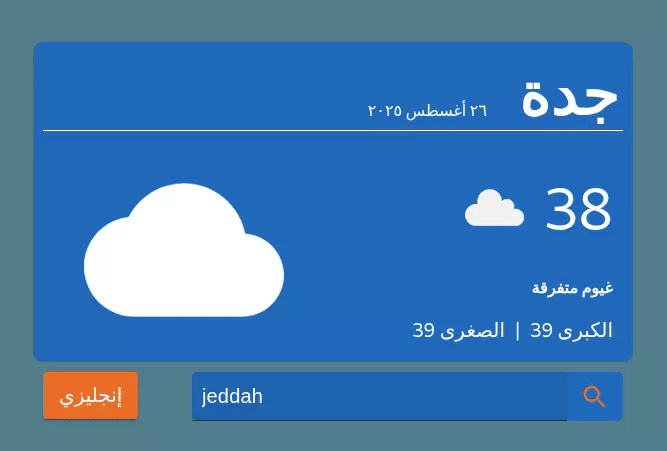

# Project 1: TodoList

### Project OverView
#### TodoList is a task management application that allows users to:
- #### Add new tasks
- #### Delete existing tasks
- #### Mark tasks as done or undo completion
- #### Edit task details
### Stack Used
- #### React.js

### Deployment
- #### You can view the live project here: [project link](https://mylisttasks.netlify.app/)

### Resourcs
- #### Link of react course in youtube [كورس رياكت | React JS Course](https://youtube.com/playlist?list=PLYyqC4bNbCIdSZ-JayMLl4WO2Cr995vyS&si=JpCT7806543MWioR)

---
# Project 2: Weather

#### This app displays the current weather of a city using the [OpenWeatherMap API](https://openweathermap.org/)

### Stack Used
- #### React.js

### App Demo

<!-- ### Deployment
- #### You can view the live project here: [project link](https://mylisttasks.netlify.app/) -->

### Resourcs
- #### Link of react course in youtube [كورس رياكت | React JS Course](https://youtube.com/playlist?list=PLYyqC4bNbCIdSZ-JayMLl4WO2Cr995vyS&si=JpCT7806543MWioR)